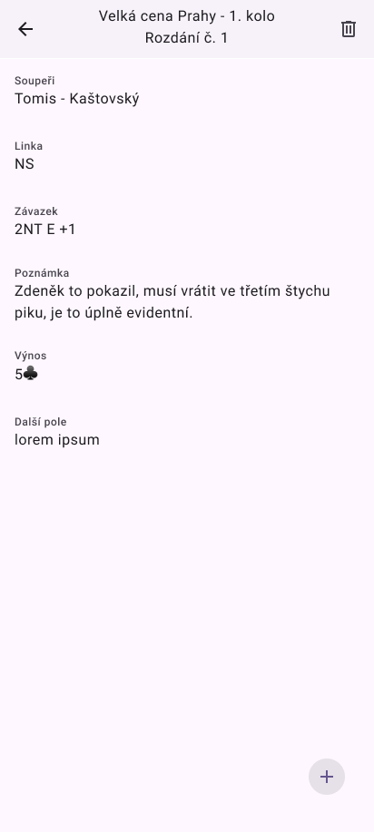

# Zápisník bridžových výsledků

## Hlavní funkce aplikace:

- Zápis výsledků z jednotlivých rozdání: Uživatelé zapisují struktrované údaje,
  jako například následující:
  - Číslo rozdání
  - Soupeři
  - Posazení
  - Vydražený závazek
  - Dosažený výsledek
  - Výnos
  - Vlastní textová pozvánka
- Strukturování do turnajů: Uživatelé mohou vytvářet turnaje, do kterých
  zapisují jednotlivá rozdání. Turnaje obsahují následující informace:
  - Název
  - Datum
  - Odkaz na výsledky
  - Vlastní poznámku
  - S kým uživatel hrál - tým či pár

## Wireframe

Následující obrázky zobrazují wireframe aplikace.

 
 
 
 
 
 

Přechody mezi jednotlivými obrazovkami jsou následující:

1. Z hlavní obrazovky je seznam turnajů.
1. Z turnajů je možné přejít na detail turnaje.
1. Z detailu turnaje je možné přejít na detail rozdání.
1. Z detailu rozdání je možné přejít na editaci rozdání.
1. Z editace rozdání je možné přejít zpět na detail rozdání.
1. Z detailu rozdání je možné přejít zpět na detail turnaje.
1. Z detailu turnaje je možné přejít na editaci turnaje.
1. Z editace turnaje je možné přejít zpět na detail turnaje.
1. Z detailu turnaje je možné přejít zpět na seznam turnajů.
1. Z hlavní obrazovky je možné přejít na přidání nového turnaje.
1. Z přidání nového turnaje je možné přejít zpět na hlavní obrazovku.
1. Z detailu turnaje je možné přejít na přidání nového rozdání.
1. Z přidání nového rozdání je možné přejít zpět na detail turnaje.
1. Z detailu rozdání je možné přejít na přidání nového rozdání.
